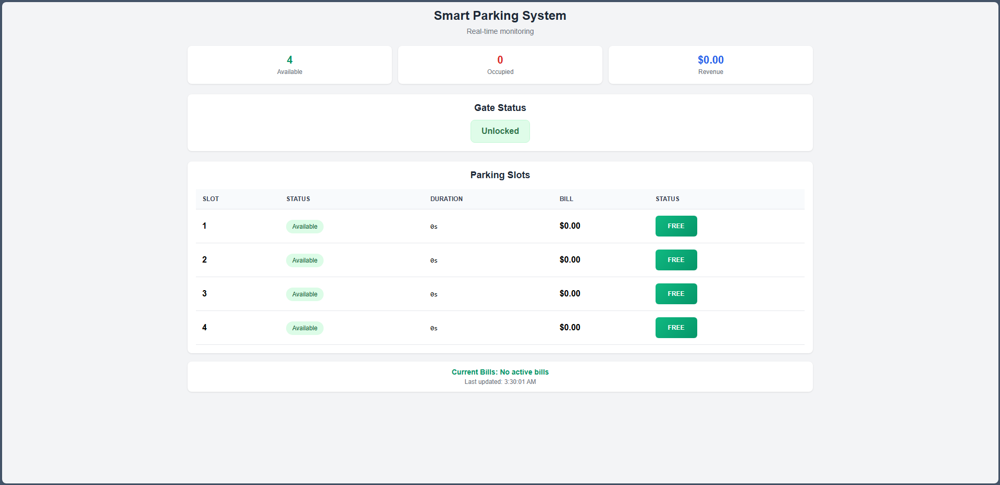

# Smart Parking System using ESP8266 NodeMcu
A Wi-Fi–enabled Smart Parking Automation System built using multiple ESP8266 microcontrollers, ultrasonic sensors, LED indicators, and a micro-servo gate mechanism. The system provides real-time slot monitoring, automatic gate control, live billing, and a web dashboard—all without requiring the internet.

---

# 🅿️ Smart Parking System

A Wi-Fi–enabled **Smart Parking Automation System** built using multiple ESP8266 microcontrollers, ultrasonic sensors, LED indicators, and a servo-controlled gate.
The system provides **real-time slot monitoring**, **automatic gate control**, **live billing**, and a **web dashboard**—all without requiring the internet.

---

## 📸 Webserver User Interface




---

# 🔧 Components Used

* **3×** ESP8266 NodeMCU
* **5×** HC-SR04 Ultrasonic Sensors
* **1×** SG90 Micro Servo (180°)
* **1×** HW-508 Passive Buzzer
* **4×** Green LEDs
* **4×** Red LEDs
* Jumper Wires

---

# ✨ Features

### 🛜 Built-In WiFi Access Point + Local Server

* ESP8266 server creates Wi-Fi AP (`ESP_AP_Server`).
* Clients auto-connect.
* No router or internet required.

### 🌐 Real-Time Web Dashboard

* HTML/CSS/JS dashboard hosted on the server.
* Shows slot status, billing, gate state, and system alerts.
* Auto-refreshing live data.

### 🤖 Ultrasonic Slot Detection

* Clients use HC-SR04 sensors.
* Detect presence and send data to server.
* Real-time updates.

### 💡 LED Indicators

* **Green LED** → Slot available
* **Red LED** → Slot occupied
* Controlled by a dedicated LED client.

### 🚧 Automated Gate System

* Servo-controlled barrier gate.
* Opens only if slots are available.
* Locked if full.

### 🔊 Buzzer Alerts

* Activates when parking is full.
* Prevents unauthorized entry.

### 🔄 Client-to-Server Data Protocol

* Sends slot data via `/sendData`.
* Lightweight JSON-style format.

### 🧮 Automatic Billing System

* Timer starts when slot becomes occupied.
* Bill calculated upon exit.
* Displayed instantly on dashboard.

### 🔐 Gate Lock Logic

* **Unlocked:** At least one slot available
* **Locked:** All slots full + buzzer activates

### 🚀 Multi-ESP Modular Architecture

* Server: Dashboard + gate + logic
* Client 1: Ultrasonic sensors
* Client 2: LED controllers

### 🧰 Clean, Scalable Code Structure

* Non-blocking ultrasonic reads
* Organized handlers
* Expandable slot system

---

# 🏗️ Project Architecture Diagram

```md
                   +---------------------------+
                   |       ESP8266 SERVER      |
                   |  • WiFi Access Point      |
                   |  • Web Dashboard          |
                   |  • Gate Servo Control     |
                   |  • Full-System Logic      |
                   +------------+--------------+
                                |
                                | Wi-Fi Communication
                                |
    +---------------------------+-----------------------------+
    |                                                         |
+---+----+                                             +------+----+
| CLIENT |                                             | CLIENT    |
|  #1    |                                             |   #2      |
| Slot   |                                             | LED Board |
| Sensor |                                             | Controller|
+--------+                                             +-----------+
• Ultrasonic sensors                              • Controls LEDs (Red/Green)
• Sends occupancy data                            • Shows slot status
```

---

# 🔄 System Flow

### 1. Car Approaches

* Gate checks availability.
* **If available:** Gate opens.
* **If full:** Gate locks + buzzer activates.

### 2. Car Enters

* Ultrasonic sensor detects presence.
* Slot marked **occupied**.
* Timer starts.

### 3. Car Leaves

* Timer stops.
* Bill calculated.
* Slot becomes **free**.

### 4. Dashboard Updates

* Slot status
* Free/occupied count
* Billing
* Gate state
* Alerts

---

# 📂 Project Structure

```
Codes/server_V2.ino      → ESP8266 Server (AP + Dashboard + Gate)
Codes/client_V2.ino      → Sensor Client (ultrasonic)
Codes/client_led_v2.ino  → LED Control Client
/Images/                 → System diagrams & photos
README.md                → Project documentation
```

---

# 📦 Installation & Setup

### 1. Upload Code

Flash each `.ino` file to the correct ESP8266.

### 2. Start Server

The server creates:

```
SSID: ESP_AP_Server
PASSWORD: 123Server456
```

### 3. Clients Connect Automatically

They send data continuously.

### 4. Open Dashboard

Go to:

```
http://192.168.4.1/
```

---
